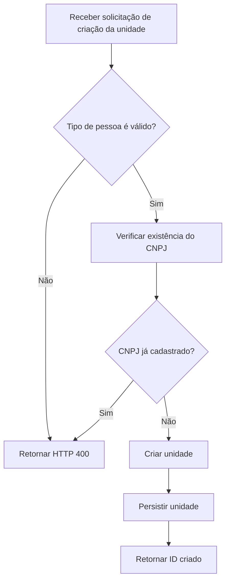

# EndpointAnalyzer — Fluxograma de Negócio enriquecido por IA

## Objetivo

Adicionar ao EndpointAnalyzer uma opção de **análise com IA do fluxo de negócio**.

A IA não deve descobrir o fluxo sozinha. O fluxo técnico deve continuar sendo obtido por análise estática com Roslyn. A IA entra depois, para:

- remover ruído de abstrações;
- agrupar chamadas técnicas equivalentes;
- traduzir métodos técnicos para ações de negócio;
- preservar decisões, validações, exceções e persistências;
- gerar um fluxo mais legível;
- manter rastreabilidade até o código-fonte.

Resultado esperado:

```text
Endpoint
   ↓
Análise estática
   ↓
Call Graph técnico
   ↓
Extração de evidências
   ↓
IA
   ↓
Business Flow estruturado
   ↓
Mermaid
```

---

## 1. Manter a análise determinística como fonte da verdade

Continuar utilizando Roslyn para descobrir:

- métodos chamados;
- símbolos e tipos reais;
- condições `if`, `switch`, guards etc.;
- exceções lançadas;
- chamadas a repositories/services;
- operações de persistência;
- entidades manipuladas;
- integrações externas;
- origem de cada informação no código.

Utilizar principalmente:

- `SemanticModel`
- símbolos Roslyn (`ISymbol`, `IMethodSymbol`, etc.)
- análise de sintaxe
- `AnalyzeDataFlow` quando necessário

A IA **não substitui essa etapa**.

---

## 2. Criar um modelo intermediário do Call Graph

Antes de enviar qualquer coisa para IA, converter o resultado bruto para uma estrutura própria.

Exemplo:

```json
{
  "endpoint": "POST /unidade/v1",
  "nodes": [
    {
      "id": "N1",
      "method": "UnidadeController.AdicionarUnidadeV1",
      "kind": "controller",
      "source": "UnidadeController.cs:237"
    }
  ],
  "edges": [
    {
      "from": "N1",
      "to": "N2"
    }
  ],
  "conditions": [],
  "exceptions": [],
  "persistenceOperations": [],
  "externalCalls": []
}
```

Esse modelo deve ser independente da interface e do Mermaid.

---

## 3. Extrair evidências antes da IA

Criar uma etapa que percorra o Call Graph e produza evidências relevantes.

### Condições

Exemplo:

```json
{
  "id": "C1",
  "expression": "!CnpjValido(request.Cnpj)",
  "method": "AdicionarUnidadeV1",
  "source": "UnidadeWebServiceApplicationService.cs:154"
}
```

### Exceções

```json
{
  "conditionId": "C1",
  "type": "DomainException",
  "message": "CNPJ já cadastrado",
  "httpStatus": 400
}
```

### Persistência

```json
{
  "type": "INSERT",
  "entity": "Unidade",
  "method": "UnidadeRepository.Adicionar",
  "source": "UnidadeRepository.cs:88"
}
```

### Consulta

```json
{
  "type": "QUERY",
  "entity": "Unidade",
  "purpose": "Verificar existência do CNPJ"
}
```

### Integração externa

```json
{
  "type": "HTTP",
  "service": "Trafegus",
  "method": "EnviarUnidade"
}
```

---

## 4. Classificar os nós técnicos

Antes da IA, classificar cada nó aproximadamente como:

```text
Controller
Application
BusinessRule
Validation
Repository
Persistence
Query
Integration
Mapping
Helper
Infrastructure
Unknown
```

A classificação determinística ajuda a IA a distinguir regra real de infraestrutura.

Exemplos normalmente colapsáveis:

```text
AutoMapper.Map
Task.ConfigureAwait
ILogger.LogInformation
Repository.GetQueryable
Include
AsNoTracking
ToListAsync
```

Esses nós podem continuar disponíveis no fluxo técnico, mas não precisam aparecer no fluxo de negócio.

---

## 5. Criar o módulo `BusinessFlowAiAnalyzer`

Responsabilidade:

```text
CallGraphResult
      +
EvidenceCollection
      ↓
BusinessFlowAiAnalyzer
      ↓
BusinessFlowResult
```

Interface sugerida:

```csharp
public interface IBusinessFlowAiAnalyzer
{
    Task<BusinessFlowResult> AnalyzeAsync(
        CallGraphResult callGraph,
        EvidenceCollection evidences,
        CancellationToken cancellationToken);
}
```

---

## 6. Enviar dados estruturados para a IA

Evitar enviar o projeto inteiro ou arquivos completos sem necessidade.

Enviar:

```text
Endpoint
Call Graph
Condições
Exceções
Persistências
Entidades
Integrações
Trechos de código estritamente necessários
```

O objetivo é reduzir:

- tokens;
- custo;
- ruído;
- chance de interpretação errada.

---

## 7. Instrução principal da IA

O prompt deve deixar claro:

```text
Você recebe um Call Graph obtido por análise estática de código C#.

Transforme o fluxo técnico em um fluxo de negócio.

Regras:

1. Não invente comportamento.
2. Toda etapa retornada deve possuir evidência no input.
3. Remova ou agrupe detalhes puramente técnicos.
4. Preserve validações que alterem o resultado da operação.
5. Preserve branches relevantes.
6. Preserve exceções e mensagens relevantes.
7. Preserve consultas que influenciem decisões.
8. Preserve persistências.
9. Preserve integrações externas.
10. Traduza nomes técnicos para descrições de negócio.
11. Não remova uma chamada somente por parecer infraestrutura se ela alterar comportamento.
12. Quando não houver evidência suficiente, marque como incerto.
13. Informe quais nós técnicos foram agrupados ou removidos.
14. Cada passo deve referenciar os IDs das evidências que o sustentam.
```

---

## 8. Forçar retorno estruturado

Não solicitar Mermaid diretamente como primeira resposta da IA.

Primeiro obter um JSON estruturado.

Exemplo:

```json
{
  "steps": [
    {
      "id": "B1",
      "type": "entry",
      "description": "Receber solicitação de criação da unidade",
      "evidenceIds": ["N1"]
    },
    {
      "id": "B2",
      "type": "validation",
      "description": "Validar o tipo de pessoa informado",
      "evidenceIds": ["C1"],
      "branches": [
        {
          "condition": "Tipo inválido",
          "target": "B3"
        },
        {
          "condition": "Tipo válido",
          "target": "B4"
        }
      ]
    }
  ],
  "collapsedNodes": [],
  "uncertainSteps": []
}
```

Utilizar **Structured Outputs / JSON Schema** para garantir que a resposta respeite o contrato esperado.

---

## 9. Modelo sugerido

```csharp
public sealed class BusinessFlowResult
{
    public required List<BusinessFlowStep> Steps { get; init; }
    public required List<CollapsedTechnicalNode> CollapsedNodes { get; init; }
    public required List<UncertainStep> UncertainSteps { get; init; }
}

public sealed class BusinessFlowStep
{
    public required string Id { get; init; }

    public required BusinessFlowStepType Type { get; init; }

    public required string Description { get; init; }

    public required List<string> EvidenceIds { get; init; }

    public List<BusinessFlowBranch> Branches { get; init; } = [];
}

public enum BusinessFlowStepType
{
    Entry,
    Validation,
    BusinessRule,
    Query,
    Transformation,
    Persistence,
    ExternalIntegration,
    Error,
    Result
}
```

---

## 10. Validar a resposta da IA

Depois da resposta:

```text
IA
 ↓
JSON Schema válido?
 ↓
EvidenceIds existem?
 ↓
Branches apontam para Steps existentes?
 ↓
Persistências citadas existem na análise estática?
 ↓
OK
```

Rejeitar ou marcar como inconsistente qualquer passo sem evidência.

Regra principal:

> A IA pode interpretar e resumir evidências, mas não pode criar comportamento sem evidência correspondente.

---

## 11. Gerar Mermaid somente após a validação

Criar um `BusinessFlowMermaidGenerator`.

Entrada:

```text
BusinessFlowResult
```

Saída:



---

## 12. Preservar rastreabilidade

Ao clicar em um nó do fluxograma, o usuário deve conseguir ver:

```text
Descrição:
Verificar se CNPJ já está cadastrado

Origem:
UnidadeApplicationService.CnpjJahCadastrado

Condição:
xCnpjExiste

Arquivo:
UnidadeApplicationService.cs

Linha:
318

Evidências:
C12
N27
Q04
```

Isso permite entender exatamente por que a IA incluiu aquele nó.

---

## 13. Mostrar o que foi removido

Adicionar opção:

```text
[ ] Mostrar nós técnicos colapsados
```

Exemplo:

```text
"Verificar existência do CNPJ"

Agrupou:
├── UnidadeApplicationService.CnpjJahCadastrado
├── UnidadeApplicationService.ObterTodosComVisibilidade
├── Repository.ObterTodos
├── Query.Where
└── Query.AnyAsync
```

Assim a simplificação não destrói informações.

---

## 14. Interface

Adicionar nas opções da análise:

```text
☑ Fluxo de negócio
   ☑ Polir fluxo utilizando IA
   ☐ Mostrar detalhes técnicos
   ☐ Mostrar nós removidos/colapsados
```

Manter duas visualizações quando IA estiver habilitada:

```text
Fluxo técnico
Fluxo de negócio
```

O fluxo técnico é a evidência original.

O fluxo de negócio é a interpretação semântica.

---

## 15. Pipeline final

```text
Endpoint
   ↓
Roslyn
   ↓
Call Graph
   ↓
SemanticModel
   ↓
Extração de condições / exceptions / persistências
   ↓
EvidenceCollection
   ↓
Classificação dos nós
   ↓
BusinessFlowAiAnalyzer
   ↓
Structured Output
   ↓
Validação contra as evidências
   ↓
BusinessFlowResult
   ↓
Mermaid Generator
   ↓
Fluxograma de negócio
```

---

## 16. Ordem de implementação

### Fase 1 — Estruturar o resultado atual

Criar:

```text
CallGraphResult
CallGraphNode
CallGraphEdge
```

### Fase 2 — Evidências

Criar:

```text
ConditionEvidence
ExceptionEvidence
PersistenceEvidence
QueryEvidence
ExternalCallEvidence
```

### Fase 3 — Classificação

Classificar nós técnicos antes da IA.

### Fase 4 — IA

Criar:

```text
IBusinessFlowAiAnalyzer
BusinessFlowAiAnalyzer
BusinessFlowResult
```

Usar retorno estruturado por JSON Schema.

### Fase 5 — Validação

Garantir que todo `EvidenceId` retornado realmente existe.

### Fase 6 — Mermaid

Criar:

```text
BusinessFlowMermaidGenerator
```

### Fase 7 — Interface

Adicionar:

```text
Polir fluxo utilizando IA
```

e disponibilizar:

```text
Fluxo técnico
Fluxo de negócio
```

---

## 17. Critérios para considerar a funcionalidade pronta

O recurso só deve ser considerado pronto quando:

- o fluxo técnico continuar disponível;
- nenhuma etapa da IA puder existir sem evidência;
- helpers e infraestrutura puderem ser agrupados;
- regras de negócio permanecerem visíveis;
- branches importantes permanecerem visíveis;
- exceções relevantes permanecerem visíveis;
- persistências permanecerem visíveis;
- integrações externas permanecerem visíveis;
- cada nó puder apontar para o código que o originou;
- o Mermaid for gerado a partir do `BusinessFlowResult`, e não diretamente da resposta textual da IA.

---

## Resultado esperado

De:

```text
Controller
 ↓
ApplicationService
 ↓
SanitizarCnpj
 ↓
Service
 ↓
Repository
 ↓
GetQueryable
 ↓
Where
 ↓
AnyAsync
 ↓
ApplicationService
 ↓
Repository
 ↓
Add
 ↓
SaveChanges
```

Para:

```text
Receber solicitação
      ↓
Normalizar CNPJ
      ↓
Validar dados
      ↓
Verificar se CNPJ já existe
     / \
   Sim  Não
    ↓    ↓
 Erro   Criar unidade
           ↓
      Persistir unidade
           ↓
      Retornar ID criado
```

Sem perder a possibilidade de rastrear cada passo até o código-fonte.

---

## Referências

- Microsoft Roslyn `SemanticModel`: https://learn.microsoft.com/en-us/dotnet/api/microsoft.codeanalysis.semanticmodel
- Microsoft Roslyn `AnalyzeDataFlow`: https://learn.microsoft.com/en-us/dotnet/api/microsoft.codeanalysis.csharp.csharpextensions.analyzedataflow
- OpenAI Structured Outputs: https://developers.openai.com/api/docs/guides/structured-outputs
- Mermaid Flowchart Syntax: https://mermaid.js.org/syntax/flowchart.html
